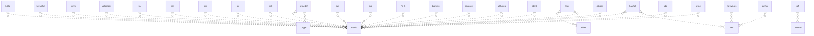

#Simbad Entity Relation Diagram

```mermaid
erDiagram
    otype }o..o{ Basic : ""
    ids }o..o{ Basic : ""
    otypes }o..o{ Basic : ""
    otypedef }o..o{ Otype : ""
    otypedef }o..o{ Basic : ""
    ident }o..o{ Basic : ""
    flux }o..o{ Basic : ""
    flux }o..o{ Filter : ""
    allfluxes }o..o{ Basic : ""
    hasRef }o..o{ Ref : ""
    hasRef }o..o{ Basic : ""
    author }o..o{ Ref : ""
    distance }o..o{ Basic : ""
    diameter }o..o{ Basic : ""
    Fe_h }o..o{ Basic : ""
    iso }o..o{ Basic : ""
    iue }o..o{ Basic : ""
    mk }o..o{ Basic : ""
    plx }o..o{ Basic : ""
    pm }o..o{ Basic : ""
    rot }o..o{ Basic : ""
    var }o..o{ Basic : ""
    velocities }o..o{ Basic : ""
    xmm }o..o{ Basic : ""
    herschel }o..o{ Basic : ""
    biblio }o..o{ Basic : ""
    Keywords }o..o{ Ref : ""
    ref }o..o{ Journal : ""
```